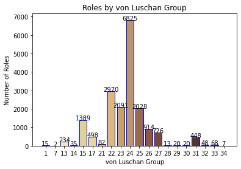
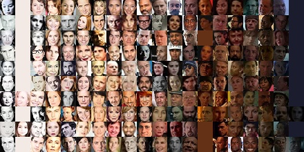
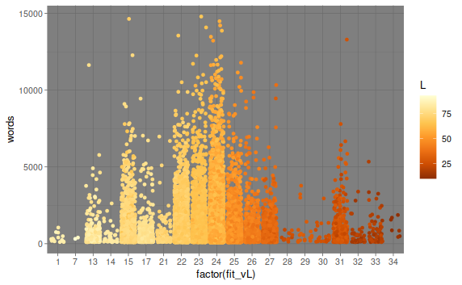
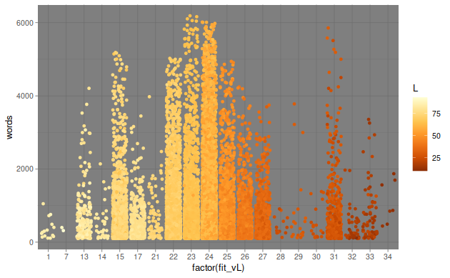
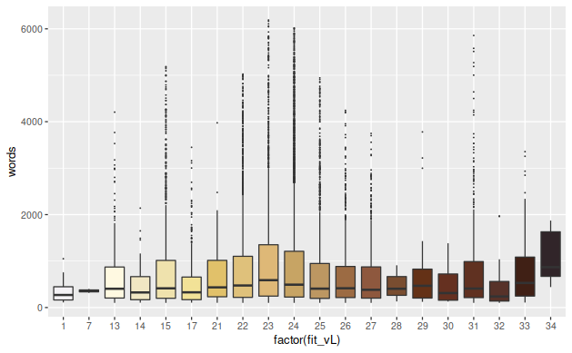

- [1. Introduction](#1-introduction)
- [2. Methodology](#2-methodology)
  - [Acquiring the data](#acquiring-the-data)
  - [Cleaning and repairing data](#cleaning-and-repairing-data)
  - [Characterize actor thumbnails](#characterize-actor-thumbnails)
- [3. Plots and discussion](#3-plots-and-discussion)
  - [Overview of basic data](#overview-of-basic-data)
  - [Word distribution](#word-distribution)

# 1. Introduction

This is an old project and figured I might as well upload. Movie_Words is based
on
[Pudding.com's "Film Dialogue" post](https://pudding.cool/2017/03/film-dialogue/)
that analyzed movie scripts to see how words are distributed by gender, age,
genre, year. Pudding scoured the web and found 2000 screen play scripts to
analyze. The pupose of this write up was to practice some coding in python/R/viz
and see how words are distributed by skin color using the same
word/character/script dataset used in "Film Dialogue". The skin color mapping
used a technique also presented by Pudding.com in
["Colorism in High Fashion"](https://pudding.cool/2019/04/vogue/) where magazine
covers were scanned for faces and used K-means clustering to determine an
average facial skin color to then analyze in various ways. A study on race using
the same dataset has been done [here](https://champebarton.github.io/). In this
study, IMDB.com was used to aquire thumbnails of actor photos along with various
attributes of the films (character names, actor, gross earnings, year) and
actors (birth year).

# 2. Methodology

## 2.1 Acquiring the data

Datasets downloaded from: https://champebarton.github.io

- **character_list7.csv**: List character names in each movie script along with
  **number of words spoken** by character, actor age at time of movie. This is
  the key file for this study with the number of words. Has missing age and some
  character names are wrong. 18,433 rows, age 1,819 null.
- **metaData7**: List script ID, imdb ttID, character names, closest matching
  imdb character name, and actor nmID. Some of the character names are wrong,
  and therefore matching character name and actor nmID are wrong. 2000 rows,
  gross 338 null.

## 2.2 Cleaning and repairing data

**Repair wrong character info.**

1.  Create a list of all characters in each movie, all_nmID.csv (126853 rows):
    ttID, nmID, actor name, character name. Scrape imdb for info.
2.  Use FuzzyWuzzy to fix character names (character_list7) to list of
    characters in each movie, try to find closest match (match score > 60). Add
    best match actor nmID and fix age at time of movie.

## 2.3 Characterize actor thumbnails

1.  Scrape imdb thumbnails. Instead of scraping the larger actor portraits to
    determine skin color, it seems like the thumbnail images have sufficient
    pixels to get a good average skin representation. 9145 thumbnails found.
2.  Used K-means to calculate average skin color for each actor. 8612 decent
    thumbnails were found. This is a much smaller subset than the total possible
    actors in the 2000 movie scripts. This is due to actors not having a profile
    picture, the computer vision (openCV) algorithm not finding a suitable face
    or the profile picture being black&white/greyscale.
3.  Experimented with 2 and 3 clusters, one cluster for skin pixels and the
    other(s) for non-skin pixels. In the end 2 clusters with a hack to
    accommadate likely outliers worked best. The pixels examined are in a
    centered oval as the rest is mostly unwanted background, hair, and shadows.

The pixels outside the oval have been set to the average skin color in the
picture below.

The non-skin pixels have been set to blue in the example below.

There are definetly pictures that were mischaracterized and many more where
lighting conditions saturate the portrait with too much light or shadow -
thereby also skewing results (see Outliers). Even in ideal portraiture, an
individuals complexion can vary quite a bit photograph to photograph such that
results here be considered with that in mind.

4.  Categorize skin color by lightness and
    [von Luschan chromatic scale](https://en.wikipedia.org/wiki/Von_Luschan%27s_chromatic_scale).
    Lightness is designated "L" and is calculated from converting the average
    skin color from BGR to hue, saturation, and **lightness**. Higher "L" values
    means lighter color. The von Luschan scale (vL) is presented below and is a
    way to categorize the worlds variety of skin colors.

- K-means was used again to categorize each of the 8612 images into one of the
  36 von Luschan categories.

5.  Prepare pictures to demonstrate skin categorizations.

- Example thumbnails per color population von Luschan (see image in next
  section).

- Extremes - In the image below, the 10 lightest and darkest faces in the
  dataset are presented. Face categorization skews toward darker than actual
  compared to lighter than actual. This looks to be due to faces being in
  shadows for 4 or 5 of the 10 presented here.

- This image represents the whole dataset. Each pixel is the average skin color
  for each of the 8612 actors from darkest to lightest.

# 3. Plots and discussion

## Overview of basic data

### Movie Release Year

- Movie releases are heavily skewed toward 1990 and after (77% of entries).

| Year        | %   |
| ----------- | --- |
| 1929 - 80   | 11% |
| 1980 - 90   | 12% |
| 1990 - 2000 | 26% |
| 2000 - 10   | 33% |
| 2010 - 15   | 18% |

### von Luschan

- There are 36 skin color categories, but some categories seem identical. The
  K-means grouping placed actors within 20 distinct groups, with group 23
  peaking at 6,825 occurances. **\[1, 7, 13-15, 17, 21-34\]**

- This bar plot has bars colored by von Luschan category. Of the 18,433 roles
  and the twenty non-zero von Luschan groups, Groups: 1, 7, 28, 29, 30, and 34
  had less than 21 occurances. Considering the accuracy of the grouping, it
  would be recommended to use a more general color scale like Fitzpatrick with 6
  groups

- The tiled image above shows which faces are categorized into each group;
  miscategorizations are visible but the the idea is that enough are categorized
  correctly to provide usefull trends for analysis. In general light skinned
  actors are more likely to be categorized into darker groups than actual.

### Lightness

- Lightness values are skewed toward lighter skin tones. Average value is 59,
  with a range of 10 - 93.

| L                     | % of Characters |
| --------------------- | --------------- |
| 0 - 20 **Darkest**    | 1%              |
| 20 -40                | 9%              |
| 40 - 60               | 36%             |
| 60 - 80               | 53%             |
| 80 - 100 **Lightest** | 1%              |

### Word count frequency

- 50% of roles have less than 478 words (1st three columns). 2.8% of roles have
  more than 5,000 words and account for 19.9% of all words in the study. 0.6% of
  roles have more than 8,500 words and account for 6.6% of all words in the
  study. 
  Each column corresponds to 200 words of dialogue.

**Actor Age**

## Word distribution

- Total Word counts by color population
- Average Word counts by color population

### Words by von Luschan and Lightness (dot plot)

- This plots shows the distribution of words per role in each von Luschan
  category.

**Words by von Luschan and Lightness (dot plot - outliers > 3 Std Dev removed,
416 rows)**

- When outliers are removed - the few characters exceeding 3 standard deviations
  beyond the mean where removed (416 out of 18433 rows), the plot evens out a
  bit more between the different vL groups. Groups (1, 7, 13, 14) make up 1.1%
  of all words, (15, 17, 21): 9%, (22, 23):30%, 24:41%, 25:10%, (26, 27):7%
  (28-34):3%

| fit_vL | roles | avg_words | pct_all_words |
| ------ | ----- | --------- | ------------- |
| 1      | 15    | 363       | 0.04          |
| 7      | 2     | 358       | 0.004         |
| 13     | 229   | 685       | 1.0           |
| 14     | 34    | 545       | 0.12          |
| 15     | 1357  | 817       | 7.0           |
| 17     | 480   | 524       | 1.6           |
| 21     | 79    | 730       | 0.37          |
| 22     | 2906  | 866       | 16.0          |
| 23     | 2036  | 1041      | 13.5          |
| 24     | 6679  | 956       | 40.7          |
| 25     | 1985  | 764       | 9.7           |
| 26     | 893   | 687       | 3.9           |
| 27     | 708   | 652       | 2.9           |
| 28     | 13    | 464       | 0.04          |
| 29     | 20    | 885       | 0.11          |
| 30     | 19    | 527       | 0.06          |
| 31     | 442   | 830       | 2.34          |
| 32     | 46    | 408       | 0.12          |
| 33     | 67    | 813       | 0.35          |
| 34     | 7     | 1112      | 0.05          |

### Averge Words by von Luschan

**Averge Words by von Luschan (outliers > 3 Std Deviations removed, 416 rows)**

- **It is interesting to note that the darkest group (34) had the highest
  average word count (1112) per role (7 roles).**

---

### Average Word count by von Luschan group

### Average Word count % by von Luschan group

### Word count and average words by Lightness

